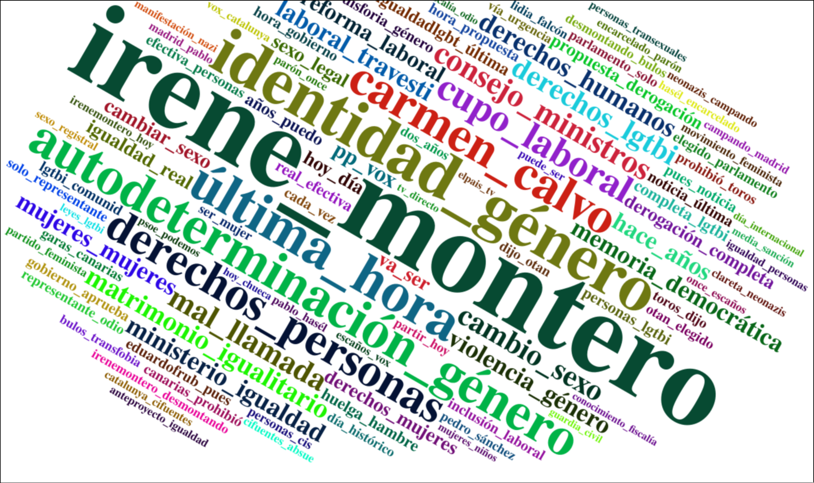

## Índice 

1. [Introducción](#introduction)
2. [Normalización de los datos](#normalizacion)
3. [Preprocesamiento de los datos](#preprocesamiento)
4. [Frecuencia de palabras](#frecuencia)
5. [Análisis de sentimientos](#sentimientos)
6. [Análisis de los tweets más virales](#virales)
7. [Anáisis de #hashtags más virales](#hashtags)
8. [Grafo de usuarios del dataset](#grafo)
9. [Análisis de comunidades](#comunidades)
10. [Conclusiones](#conclusiones)

### 1. Introducción <a name="introduccion"></a>

Popularmente conocida como la "Ley Trans", es uno de los proyectos más controvertidos del gobierno de coalición de izquierda. Incluso dentro de la coalición hay opiniones opuestas. Si se aprueba el proyecto de ley, España se convertiría en el país más grande de Europa en permitir que las personas cambien legalmente el nombre y género en sus documentos de identidad sin la necesidad de años de terapia hormonal o diagnóstico médico. Esto ha provocado un gran debate y/o fuertes posicionamientos al respecto, lo que también se ha reflejado en redes sociales como Twitter.

En este documento se van a analizar 14.1 millones de tweets del 13/01/2021 al 12/10/2022 en relación a la [https://www.boe.es/buscar/doc.php?id=BOE-A-2023-5366](Ley trans). El dataset contiene más de 14 millones de tweets, con 257.000 usuarios y 738.651 aristas (respuestas entre usuarios).

#### 1.1. Importar librerías

```{r}
# Importaciones de las librerias que utilizaremos
library(quanteda)
library(quanteda.textplots)
library(stringr)
library(wordcloud2)
library(tm)
library(tidytext)
library(tidyverse)
library(syuzhet)
library(dplyr)
library(textdata)
library(ggplot2)
library(htmlwidgets)
library(igraph)
```

#### 1.2. Establecer el directorio de trabajo

```{r}
# Establecer directorio de trabajo
setwd("/home/antonio/Repos/ley-trans")
```

#### 1.3. Cargar el dataset

El dataset es de Kaggle y se puede encontrar en el siguiente enlace: https://www.kaggle.com/datasets/hectorfr1984/spanish-trans-law-twitter-dataset

```{r}
df <- data.frame()
dataset_csv <- read.csv("spanish-trans-law-twitter-dataset.csv", header = TRUE, sep = ",", fill = TRUE)
df <- rbind(dataset_csv, df)
```

Guardamos el dataset en un archivo rda para poder trabajar con él más adelante.

```{r}
# Guardamos el data frame en un archivo rda
save(df, file = "df.rda")
```

### 2. Normalización de los datos <a name="normalizacion"></a>

El dataset no está normalizado, ya que en cada fila tenemos información de los usuarios la cual debería estar en una tabla aparte, por lo tanto vamos a separar el dataframe en dos dataframes de usuarios y tweets.

#### 2.1. Daframe de usuarios

El dataframe de usuarios tendrá los siguientes campos: `user_id`, `user_screen_name`, `user_description`, `user_created_at_iso`, `user_followers` y `user_friends`.

```{r}
df_usuarios <- df %>% 
  select(user_id, user_screen_name, user_description, user_created_at_iso, user_followers, user_friends) %>% 
  distinct()
```

Los followers y friends van variando en función del tiempo, por lo tanto para no tener filas repetidas, usaremos el máximo de followers y friends de cada usuario.

```{r}
df_usuarios <- df_usuarios %>%
  group_by(user_id) %>%
  summarise(user_screen_name = first(user_screen_name),
            user_description = first(user_description),
            user_created_at_iso = first(user_created_at_iso),
            user_followers = max(user_followers),
            user_friends = max(user_friends))
```

También normalizaremos la fecha de creación de los usuarios.

```{r}
df_usuarios$user_created_at_iso <- as.POSIXct(df_usuarios$user_created_at_iso, format="%Y-%m-%d")
```

Guardamos el dataframe de usuarios en un archivo rda.

```{r}
# Guardamos el data frame en un archivo rda
save(df_usuarios, file = "df_usuarios.rda")
```

El dataframe de usuarios tendrá los siguientes campos: `tweet_id`, `in_reply_to_user_id`, `user_id`, `retweet_id`, `retweet_user_id`, `tweet_created_at_iso`, `tweet_full_text`.

```{r}
df_tweets <- df %>% 
  select(tweet_id, in_reply_to_user_id, user_id, retweet_id, retweet_user_id, tweet_created_at_iso, tweet_full_text) %>% 
  distinct()
```

Guardamos el dataframe de tweets en un archivo rda.

```{r}
# Guardamos el data frame en un archivo rda
save(df_tweets, file = "df_tweets.rda")
```

### 3. Preprocesamiento de los datos <a name="preprocesamiento"></a>

Crearemos un nuevo dataframe `df_filtered` con el contenido de los tweets filtrado.

```{r}
df_filtered <- df_tweets
```

#### 3.1. Normalizar las fechas

Para poder trabajar con las fechas, vamos a convertirlas a formato POSIXct

```{r}
df_filtered$tweet_created_at_iso <- as.POSIXct(df_filtered$tweet_created_at_iso, format="%Y-%m-%d")
```

#### 3.2. Pasar los tweets a minúsculas

Es necesario pasar los tweets a minúsculas para evitar que palabras iguales pero escritas de forma diferente se consideren diferentes.

```{r}
#Convertimos todas las letras a minúsculas
df_filtered$tweet_full_text <- tolower(df_filtered$tweet_full_text)
```

#### 3.3. Eliminar stopwords

Las stopwords son palabras que no aportan significado al texto, como artículos, preposiciones, etc. Vamos a eliminarlas de los tweets.

```{r}
# Eliminar las stopwords del español
df_filtered$tweet_full_text <- removeWords(df_filtered$tweet_full_text, stopwords("es"))
```

Se ha observado que es muy popular en los tweets el uso de stopwords acortadas, como "q" en lugar de "que", "x" en lugar de "por", etc. Por lo tanto, eliminaremos las palabras de una sola letra.

```{r}
# Eliminar las palabras de una sola letra
df_filtered$tweet_full_text <- str_replace_all(df_filtered$tweet_full_text, "\\b[a-zA-Z]\\b", "")
```

#### 3.4. Eliminar URLs, números, caracteres especiales y palabras no deseadas

Eliminamos las URLs de los tweets.

```{r}
# Eliminar urls
df_filtered$tweet_full_text <- str_replace_all(df_filtered$tweet_full_text, "https?://([^/\\s]++)\\S*+|http?://([^/\\s]++)\\S*+", "")
```

Eliminamos los números y los caracteres especiales.

```{r}
# Eliminar los números y los carácteres especiales
df_filtered$tweet_full_text <- str_replace_all(df_filtered$tweet_full_text, "[^[:alpha:][:space:]]", "")
```

Por último eliminamos las palabras que no sean de nuestro interés. Las palabras "ley" y "trans" son redundantes ya que todos los tweets van en relación a ese mismo tema. La palabra "si" es muy común en los tweets y no aporta información relevante, y "rt" es la abreviatura de "retweet".

```{r}
# Eliminar palabras que no sean de nuestro interés
palabras_eliminar = c("ley", "trans", "leytrans", "rt", "si")
df_filtered$tweet_full_text <- removeWords(df_filtered$tweet_full_text, palabras_eliminar)
```

#### 3.5. Eliminar hashtags, menciones y retweets

```{r}
# Eliminar los hashtags, menciones y retweets
df_filtered$tweet_full_text <- str_replace_all(df_filtered$tweet_full_text, "#\\S+", "")
df_filtered$tweet_full_text <- str_replace_all(df_filtered$tweet_full_text, "@\\S+", "")
df_filtered <- df_filtered[!grepl("^RT", df_filtered$tweet_full_text),]
```

#### 3.6. Guardar el dataset filtrado

```{r}
# Guardamos el data frame en un archivo r### 4. Frecuencia de palabras <a name="frecuencia"></a>da
save(df_filtered, file = "df_filtered.rda")
```

### 4. Frecuencia de palabras <a name="frecuencia"></a>

#### 4.1. Crear matriz de frecuencia de palabras

##### 4.1.1. Crear corpus y tokens
 
Creamos el corpus de los tweets, que como ya se ha mencionado, es un conjunto de documentos de texto.

```{r}
# Crear un corpus con los tweets
corpus_tweets <- corpus(df_filtered$tweet_full_text)
```

Creamos los tokens, que son las palabras que componen los documentoss. Indicamos que queremos eliminar los números, los signos de puntuación, los símbolos, los separadores y las URLs. 

```{r}
# Generamos los tokens
token_tweets <-quanteda::tokens(corpus_tweets,
                              what = "word",
                              remove_numbers = TRUE,
                              remove_punct = TRUE,
                              remove_symbols = TRUE,
                              remove_separators = TRUE,
                              remove_url = TRUE)
```

##### 4.1.2. Crear matriz de frecuencia

```{r}
# Generamos la matriz de frecuencia de los tweets
matrix_tweets <-dfm(token_tweets)
```

#### 4.2. Barplot de las 10 palabras más frecuentes

Primero sacamos las 10 palabras más frecuentes con la ayuda de nuestra matriz de frecuencia.

```{r}
# Mostramos las 10 palabras más frecuentes
top_10 <- topfeatures(matrix_tweets, 10)
top_10
```

Pasamos el objeto `top_10` a un data frame para poder hacer el gráfico.

```{r}
# Convertimos el objeto top_10 a un data frame
top_10_df <- data.frame(palabra = names(top_10), frecuencia = as.numeric(top_10))
```

Creamos el gráfico de barras con las 10 palabras más frecuentes.

```{r}
# Barplot
barplt <- ggplot(top_10_df, aes(x = reorder(palabra, frecuencia), y = frecuencia)) +
  geom_bar(stat = "identity", fill = "steelblue") +
  coord_flip() +
  theme_minimal() +
  labs(
       x = "Palabra",
       y = "Frecuencia")

barplt
```

Por último, guardamos el gráfico de barras.

```{r}
# Guardamos el gráfico
ggsave("barplot.png", plot = barplt, width = 10, height = 5, units = "in")
```

#### 4.3. Wordcloud de las palabras más frecuentes

##### 4.3.1 Wordcloud normal

En este caso sacaremos las 100 palabras más frecuentes y las pasamos a data frame.

```{r}
# Hacemos el dataframe del top 100
top_100 <- topfeatures(matrix_tweets, 100)
top_100_df <- data.frame(palabra = names(top_100), frecuencia = as.numeric(top_100))
```

Creamos el wordcloud con las 100 palabras más frecuentes. Ajustamos los parametros `minRotation` y `maxRotation` y `rotateRatio` para darle un aspecto más atractivo.

```{r}
# Wordcloud
worldcloud_palabras <- wordcloud2(top_100_df, size = 1.0 , minRotation = -pi/6, maxRotation = -pi/6, rotateRatio = 1)
worldcloud_palabras
```

En el wordcloud la palabra más predominante es personas, ya que se usa mucho "personas trans"; lo mismo pasa con mujeres ("mujeres trans"). También podemos encontrar los 4 pártidos políticos más importantes de España: PSOE, PP, Vox y Podemos. Destaca también la palabra "menores" que va en relación a las críticas de la ley por parte de los detractores. Otras palabras en relación al tema son género, sexo y lgtpi.

Guardamos el wordcloud. Solo se guardará el html, ya que el wordcloud2 no se puede guardar en formato png.

```{r}
# Guardar el wordcloud
htmlwidgets::saveWidget(worldcloud_palabras, "wordcloud_palabras.html", selfcontained = TRUE)
```

##### 4.3.2 Wordcloud de bigramas

Generamos los bigramas.

```{r}
# Generamos los bigramas
bigramas <- tokens_ngrams(token_tweets, n = 2)
```

Creamos la matriz de frecuencia de los bigramas.

```{r}
# Generamos la matriz de frecuencia de los bigramas
matrix_bigramas <- dfm(bigramas)
```

Sacamos las 100 palabras más frecuentes de los bigramas.

```{r}
top_100 <- topfeatures(matrix_bigramas, 100)
top_100_df <- data.frame(palabra = names(top_100), frecuencia = as.numeric(top_100))
```

Creamos el wordcloud de los bigramas.

```{r}
# Wordcloud
worldcloud_palabras_bigramas <- wordcloud2(top_100_df, size = 1.0 , minRotation = -pi/6, maxRotation = -pi/6, rotateRatio = 1)
```


En el caso de los bigramas figuras políticas como Irene Montero (ex-ministra de igualdad) y Carmen Calvo (actual presidenta del Consejo de Estado). Otras palabras en relación al tema son "identidad genero", "autodeterminación genero" y "derechos personas". En general aparecen muchos bigramas con la palabra derechos, lo cual puede indicar que la ley se ve como un avance en los derechos de las personas.

Lo guardamos.

```{r}
# Guardar el wordcloud
htmlwidgets::saveWidget(worldcloud_palabras_bigramas, "wordcloud_bigramas.html", selfcontained = TRUE)
```

### 5. Análisis de sentimientos <a name="sentimientos"></a>

El análisis de sentimientos es una técnica que consiste en determinar si un texto es positivo, negativo o neutro. Para ello, se asigna un valor numérico a cada palabra del texto mediante un diccionario sentimental. En nuestro caso, al ser un dataset en español, no existen muchos diccionarios sentimentales, por lo que utilizaremos la función `get_sentiment` del paquete `syuzhet`, la cual primero traduce la palabra al inglés y luego le asigna un valor sentimental.

#### 5.1. Crear diccionario sentimental

Primero creamos un tidyset con los tweets.

```{r}
# Creamos un tidyset con los tweets
tidy <- df_filtered %>% 
  unnest_tokens(word, tweet_full_text)
```

Para ahorrarnos tiempo de computo, vamos a generar un diccionario sentimental con todas las palabras del dataset.

```{r}
# Creamos un diccionario sentimental con todas las palabras del dataset usando la función get_sentiment(word, method = "nrc", lang="spanish")
sentiment_dict <- tidy %>%
  distinct(word) %>%
  mutate(sentiment = get_sentiment(word, method = "nrc", lang="spanish"))
```

Agregaremos algunas palabras customizadas que el diccionario sentimental no ha detectado.

```{r}
palabras_añadir = c("facha","nazi","racista",
                    "racistas","nazis","gilipollas",
                    "sanchista","sanchistas","maricones",
                    "alertafeminista","fachas","vertederofacha",
                    "neonazis","neonazi","feminazis",
                    "terfisfeminazi","transfobo","machista",
                    "machismo","sexta","transfobia",
                    "terf","terfs","terfas",
                    "retrograda","transexcluyente","transexcluyentes",
                    "feminazi","fachasnazis","maricas",
                    "machirulo","perro","derrogación",
                    "dictador","franco","fascista",
                    "progre","retroceso","podemita",
                    "podemitas","retrogrado","homófobo",
                    "homófobos","homófobas","homofobia",
                    "rojo", "rojos","puto",
                    "putos", "bulo","bulos",
                    "comunista","comunistas","violador",
                    "violadores","patriarcado","patriarcal",
                    "maricón","comunismo","socialcomunista",
                    "pitorreo","terfachas","travelo")

# Si la palabra ya está recogida, cambiamos su valor sentimental a -3
new_sentiment_dict <- sentiment_dict %>%
  mutate(sentiment = ifelse(word %in% palabras_añadir, -3, sentiment))

# Si la palabra no está recogida, la añadimos con valor sentimental -3
new_sentiment_dict <- new_sentiment_dict %>%
  anti_join(data.frame(word = palabras_añadir), by = "word") %>%
  bind_rows(data.frame(word = palabras_añadir, sentiment = -3))
```

#### 5.2. Calcular sentimiento de los tweets

Una vez tenemos el diccionario sentimental, calculamos el sentimiento de cada tweet.

```{r}
# Ahora a cada tweet le añadimos el sentimiento
tweets_sentiment <- tidy %>%
  inner_join(new_sentiment_dict, by = "word") %>%
  group_by(tweet_id) %>%
  summarise(sentiment = sum(sentiment))
```

#### 5.3. Histograma de la cantidad de tweets por sentimiento

Mostramos el histograma de los sentimientos.

```{r}
ggplot(data = tweets_sentiment, aes(x = sentiment)) + 
  geom_bar(color = 'darkslategray', fill = 'steelblue') + 
  xlab("Sentimiento") + 
  ylab("Cantidad de Tweets") + 
  ggtitle("Gráfico sentimiento")

# Guardamos el gráfico
ggsave("sentiment.png", plot = last_plot(), width = 10, height = 5, units = "in")
```

Por último, calculamos el porcentaje de tweets positivos, negativos y neutros.

```{r}
# Calcular porcentaje de tweets positivos, negativos y neutros
tweets_sentiment %>%
  summarise(
    positivos = sum(sentiment > 0) / n() * 100,
    negativos = sum(sentiment < 0) / n() * 100,
    neutros = sum(sentiment == 0) / n() * 100
  )
```

Vemos que en general los tres tipos de sentimientos están bastante equilibrados, aunque predominan los neutros y entre los positivos y negativos ganan los positivos. Que haya más sentimiento positivo en relación a la ley puede indicar que en general hay mas apoyo que detractores de la ley.

#### 5.4. Gráfico de sentimiento en el tiempo

Generaremos el gráfico del sentimiento en el tiempo con ambos diccionarios para comprobar si las palabras añadidas han afectado al sentimiento de los tweets.

##### 5.4.1. Gráfico de sentimiento en el tiempo con diccionario modificado

Primero, creamos un dataframe con la fecha y el sentimiento de cada tweet.

```{r}
# Creamos un dataframe con la fecha y el sentimiento de cada tweet
df_sentimiento <- df_filtered %>%
  inner_join(tweets_sentiment, by = "tweet_id") %>%
  select(tweet_created_at_iso, sentiment)
```

Creamos un gráfico de sentimiento en el tiempo.

```{r}
# Gráfico de sentimiento en el tiempo
ggplot(data = df_sentimiento,
       aes(x = tweet_created_at_iso,
           y = sentiment
          )) + 
  geom_smooth(color = 'darkslategray') + 
  xlab("Fecha") + 
  ylab("Sentimiento") + 
  scale_x_datetime(date_labels = "%b", date_breaks = "1 month") +
  ggtitle("Gráfico de sentimiento en el tiempo")
```

El 10 de marzo de 2021 comenzo la huelga de hambre de Mar Cambrolle la cual ya ha sido mencionada en el análisis de hashtags. A partir de esa fecha, el sentimiento positivo a ido creciendo. El 17 de marzo de ese mismo año se registró la *Proposición de Ley para la igualdad real y efectiva de las personas trans* en el Congreso de los Diputados, lo que puede haber influido en el sentimiento positivo. El 18 de mayo se votó por la admisión de la ley, la cual fue rechazada debido a los votos de PP, Vox y por la abstención del PSOE.

El 29 de junio de 2021, el ministerio de igualdad presentó el anteproyecto de ley, en el que se incluía la autodeterminación de género para mayores de 16 años, y la eliminación de la necesidad de diagnóstico médico para cambiar el género en el DNI. A partir de la presentación del anteproyecto, se observa un mínimo que por primera vez es negativo en el gráfico. Puede deverse a que cuando ses presentó el anteproyecto, se incluyeron medidas que no gustaron a los detractores de la ley.

En junio de 2022 se observa un gran pico de positividad, se puede deber a que el 27 de junio de 2022 el documento de anteproyecto fue aprobado, pasando a ser un proyecto de ley. Luego, vemos un gran descenso en la positividad, que puede deberse a la perdida del gran interés inicial de la izquierda y a las críticas de los retractores.

El 8 de septiembre se anunció que se reducirían la mitad de los plazos de la ley, lo cual haría que se aprobase ante la ley. Justo en este periodo comienza a subir la positividad, lo cual puede deberse a que la ley finalmente se aprobará.

##### 5.4.2. Gráfico de sentimiento en el tiempo con diccionario sin modificar

Si lo comparemos con el gráfico generado usando el diccionario sin modificar, vemos que las palabras customizadas han afectado notablemente al sentimiento de los tweets.

```{r}
tweets_sentiment_old <- tidy %>%
  inner_join(sentiment_dict, by = "word") %>%
  group_by(tweet_id) %>%
  summarise(sentiment = sum(sentiment))

df_sentimiento_old <- df_filtered %>%
  inner_join(tweets_sentiment_old, by = "tweet_id") %>%
  select(tweet_created_at_iso, sentiment)

ggplot(data = df_sentimiento_old,
       aes(x = tweet_created_at_iso,
           y = sentiment
          )) + 
  geom_smooth(color = 'darkslategray') + 
  xlab("Fecha") + 
  ylab("Sentimiento") + 
  scale_x_datetime(date_labels = "%b", date_breaks = "1 month") +
  ggtitle("Gráfico de sentimiento en el tiempo")
```

### 6. Análisis de los tweets más virales <a name="virales"></a>

Primero sacaremos los tweets más virales, es decir, los tweets con más respuestas. Para ello agruparemos los tweets por la columna `in_reply_to_user_id`, que indica el id del tweet al que se responde, y contaremos cuántas respuestas tiene cada tweet.

```{r}
tweets_virales <- df_tweets %>%
  group_by(retweet_id) %>%
  summarise(retweets = n()) %>%
  arrange(desc(retweets))
```

El tweet más viral saldra como `NA` ya que la mayoría te tweets no son en respuesta a otros, por lo tanto eliminaremos ese tweet.

```{r}
tweets_virales <- tweets_virales[-1,]
tweets_virales
```

Crearemos una función para ver el n-ésimo tweet más viral.

```{r}
ver_tweet_viral <- function(n) {
  tweet_viral_id <- tweets_virales$retweet_id[n]
  tweet <- subset(df_tweets, tweet_id == tweet_viral_id)
  user <- subset(df_usuarios, user_id == tweet$user_id)
  
# Mostramos la información del tweet
cat(sprintf("Retweets: %d\nUsuario: %s\nDescripción:%s\nContenido:%s",
            tweets_virales$retweets[n], user$user_screen_name,
            user$user_description, tweet$tweet_full_text))
}
```

El tweet con mayor número de retweets (5119) es a favor de la ley, y es del presidente de Más Madrid, `@EduardoFRub`. El número de retweets puede parecer bajo, pero esto se debe a que el dataset no recoge todos los retweets de cada tweet.

```{r}
ver_tweet_viral(1)
```

El segundo tweet más viral (4835), va en contra de la ley y es de una usuaria canaria con 3641 followers. En el tweet, se queja de que la comunidad de canarias haya aprobado la ley.

```{r}
ver_tweet_viral(2)
```

El tercer tweet más viral, es de  Irene Montero, ex ministra de Igualdad. Se trata de un hilo desmintiendo bulos de la ley trans.

```{r}
ver_tweet_viral(3)
```


### 7. Anáisis de #hashtags más virales <a name="hashtags"></a>

Los hashtags son una forma de categorizar los tweets y de hacer que estos sean más visibles. Nos pueden ayudar a conocer los temas más populares sobre la ley.

Sacamos los hashtags más virales.

```{r}
hashtags_virales <- df_tweets %>%
  filter(str_detect(tweet_full_text, "#")) %>%
  mutate(hashtags = str_extract_all(tweet_full_text, "#\\w+")) %>%
  unnest(hashtags) %>%
  group_by(hashtags) %>%
  summarise(tweets = n()) %>%
  arrange(desc(tweets))
```

Visualizamos los hashtags más virales.

```{r}
hashtags_virales
```

#### 7.1. Análisis del hashtag #HuelgaDeHambreTrans

El primer hastag interesante es el de `#HuelgaDeHambreTrans`, veamos de que trata este sentimiento.

Sacamos tweets con el hashtag `#HuelgaDeHambreTrans`.

```{r}
df_tweets_huelga <- df_tweets %>%
  filter(str_detect(tweet_full_text, "#HuelgaDeHambreTrans"))

# Añadimos el número de retweets a los tweets
df_tweets_huelga <- tweets_virales %>%
  inner_join(df_tweets_huelga, by = c("retweet_id" = "tweet_id"))

# Los ordenamos por número de retweets
df_tweets_huelga <- df_tweets_huelga[order(-df_tweets_huelga$retweets),]
```

Para ver los tweets definiremos una función rápido para ver tweets.

```{r}
ver_tweet <- function(n) {
  tweet <- df_tweets_huelga[n,]
  user <- subset(df_usuarios, user_id == tweet$user_id)
  
  # Mostramos la información del tweet
  cat(sprintf("Usuario: %s\nDescripción:%s\nContenido:%s\nRetweets: %i", user$user_screen_name, user$user_description, tweet$tweet_full_text, tweet$retweets))
}
```

Leeamos un tweet cualquiera con el hashtag `#HuelgaDeHambreTrans`.

El primer tweet no va en relación a la huelga, es de una mujer trans que comenta como el partido feminista ha convocado un encuentro anti trans. El grupo de feministas en contra de las personas trans es conocido como TERF, pero en español se utiliza más el termino peroyativo "terfas". Estas feministas consideran que las mujeres trans, al haber nacido hombres, no pueden ser consideradas mujeres y que son "hombres infiltrados".

```{r}
ver_tweet(1)
```

El segundo tweet más viral de `#HuelgaDeHambreTrans` explica que la huelga trans se debe al bloqueo de la ley impuesto por el PSOE.

```{r}
ver_tweet(2)
```

Veamos el último tweet en relación al hashtag `#HuelgaDeHambreTrans`. La activista trans Mar Cambrolle, cuenta que la huelga será de 3 días y que se quieren conseguir reconocer un derecho humano.

```{r}
ver_tweet(4)
```

#### 7.2. Análisis del hashtag #LeyTransYa

Ahora veamos uno de los hashtags a favor de la ley, `#LeyTransYa`.

Sacamos tweets con el hashtag `#LeyTransYa`.

```{r}
df_tweets_ley <- df_tweets %>%
  filter(str_detect(tweet_full_text, "#LeyTransYa"))

# Añadimos el número de retweets a los tweets
df_tweets_ley <- tweets_virales %>%
  inner_join(df_tweets_ley, by = c("retweet_id" = "tweet_id"))

# Los ordenamos por número de retweets
df_tweets_ley <- df_tweets_ley[order(-df_tweets_ley$retweets),]

ver_tweet_ley <- function(n) {
  tweet <- df_tweets_ley[n,]
  user <- subset(df_usuarios, user_id == tweet$user_id)
  
  # Mostramos la información del tweet
  cat(sprintf("Usuario: %s\nDescripción:%s\nContenido:%s\nRetweets:%s",
   user$user_screen_name, user$user_description, tweet$tweet_full_text, tweet$retweets))
}
```

El primer tweet es conciso y directo, es de un usuario que pide la aprobación de la ley.

```{r}
ver_tweet_ley(1)
```

El siguiente tweet tiene un tono más agresivo (Stay angry, #AngryTransYouth) y da animos al colectivo a 'cambiar las cosas'.

```{r}
ver_tweet_ley(2)
```

El último tweet que veremos es de un usuario que celebra la aprobación del dictámen de la ley.

```{r}
ver_tweet_ley(3)
```

#### 7.3. Análisis del hashtag #NoLeyTrans

Los 13 primeros #hastags vemos que son a favor de la ley, uno de los primeros negativos es `#NoLeyTrans`, veamos algunas de las opiniones en contra de la ley.

Sacamos tweets con el hashtag `#NoLeyTrans`.

```{r}
df_tweets_no_ley <- df_tweets %>%
  filter(str_detect(tweet_full_text, "#NoLeyTrans"))

# Añadimos el número de retweets a los tweets
df_tweets_no_ley <- tweets_virales %>%
  inner_join(df_tweets_no_ley, by = c("retweet_id" = "tweet_id"))

# Los ordenamos por número de retweets
df_tweets_no_ley <- df_tweets_no_ley[order(-df_tweets_no_ley$retweets),]

ver_tweet_no_ley <- function(n) {
  tweet <- df_tweets_no_ley[n,]
  user <- subset(df_usuarios, user_id == tweet$user_id)
  
# Mostramos la información del tweet
cat(sprintf("Usuario: %s\nDescripción:%s\nContenido:%s\nRetweets:%d",
 user$user_screen_name, user$user_description, tweet$tweet_full_text, tweet$retweets))
}
```

Veamos un tweet en contra de la ley.

El primer tweet parace ser de otra feminista TERF, que habla de como se les va a 'lava el cerebro a las niñas para que se crean chicos'.

```{r}
ver_tweet_no_ley(1)
```

El segundo tweet con más retweets es de un usuario que odia a la izquierda. El tweet incita a la gente a popularizar el hashtag `#NoLeyTrans` para manifestar el rechazo a la ley.

```{r}
ver_tweet_no_ley(2)
```

El tercer tweet es de ConfluenciaMF, una organización feminista TERF, que cuenta como una compañera de la organización hablará en la 1 sobre 'el disparate' de la ley.

```{r}
ver_tweet_no_ley(3)
```

Cabe destacar que los tweets del hashtag `#NoLeyTrans` tienen muchos menos retweets que los dos otros hastags a favor.

#### 7.4. Conclusiones de los hashtags

Hemos visto que los hashtags a favor de la ley tienen más retweets que los hashtags en contra. Esto puede indicar que la ley tiene más apoyo que detractores. Además, aunque en un principio pudiese parecer que los detractores de la ley fuesen en su mayoría votantes de derechas, parece que la mayoría es el colectivo feminista TERF.

### 8. Grafo de usuarios del dataset <a name="grafo"></a>

#### 8.1. Grafo de interacciones entre usuarios

Nuestro dataset no contiene la id de los tweets de respuesta, pero si la de los usuarios a los que se responde. Por lo tanto, crearemos un grafo de interacciones entre usuarios.

Primero, creamos un data frame con las columnas `user_id` y `in_reply_to_user_id`.

```{r}
df_interacciones <- df_filtered %>%
  select(user_id, in_reply_to_user_id) %>%
  na.omit()
```

Creamos el grafo de interacciones.

```{r}
grafo <- graph_from_data_frame(df_interacciones, directed = TRUE)
```

Crearemos una función para ver los usuarios con más interacciones.

```{r}
# Sacamos el usuario con más interaccionesmarx
usuarios_interacciones <- degree(grafo, mode = "in")

# Creamos un data frame con los usuarios y sus interacciones
df_usuarios_interacciones_id <- data.frame(
  user_id = as.numeric(names(usuarios_interacciones)),
  interacciones = as.numeric(usuarios_interacciones))

df_usuarios_interacciones_id <- df_usuarios_interacciones_id[order(-df_usuarios_interacciones_id$interacciones),]

# Al dataframe le añadimos una columna con el nombre de usuario
df_usuarios_interacciones <- df_usuarios_interacciones_id %>%
  inner_join(df_usuarios, by = "user_id")

# Seleccionamos solo las columnas del nombre y las interacciones
df_usuarios_interacciones <- df_usuarios_interacciones %>%
  select(user_screen_name, interacciones)

head(df_usuarios_interacciones, 10)
```

Vemos que los 5 usuarios más relevantes son políticos de izquierdas, lo que puede indicar que la izquierda habla más del tema que la derecha.

#### 8.2. Usuarios con más seguidores

Creamos un data frame con los usuarios y sus seguidores.

```{r}
df_usuarios_seguidores <- df_usuarios %>%
  select(user_id, user_screen_name, user_followers) %>%
  arrange(desc(user_followers))

df_usuarios_seguidores
```

Mucho de las cuentas con más seguidores son cuentas de medios de comunicación. Aunque seán los usuarios con más seguidores, vemos que no son los usuarios con más interacciones.


### 9. Análisis de comunidades <a name="comunidades"></a>

Debido al tamaño y la complejidad del dataset, hemos decidido centrarnos en comunidades pequeñas pero de las cuales tenemos la certeza de que están a favor o en contra de la ley.

#### 9.1. Generar comunidades

Al intentar analizar las comunidades mediante un algoritmo como el de Louvain, los resultados no son los esperados. Por lo tanto, utilizaremos un método más simple, que consiste en agrupar los usuarios por el contenido de su biografía.

Observando a los usuarios, vimos que es bastante común poner banderas en la descripción de los perfiles. Estas banderas, aunque no siempre tienen que ver con la opinión sobre la ley, nos sirven como punto de partida para agrupar a los usuarios.

##### 9.1.1. Usuarios a favor

Primero, sacamos los usuarios que tienen en su descripción la bandera trans. Hemos asumido que los usuarios que tienen la bandera trans en su descripción están a favor de la ley.

Obtenemos una comunidad de 722 usuarios.

```{r}
df_usuarios_favor <- df_usuarios %>%
  filter(str_detect(user_description, "🏳️‍⚧️"))
df_usuarios_favor
```

El siguiente paso será recoger todos los tweets de los usuarios a favor de la ley.

```{r}
df_tweets_favor <- df_filtered %>%
  inner_join(df_usuarios_favor, by = "user_id")
```

##### 9.1.2. Usuarios de vox

Sacaremos los usuarios que tengan en su descripción la palabra "vox". 

En este caso tenemos una comunidad de 369 usuarios, aproximadamente la mitad que la comunidad a favor (esto no significa que haya, en general, la mitad de usuarios en contra que a favor).

```{r}
df_usuarios_vox <- df_usuarios %>%
  filter(str_detect(user_description, "vox"))
df_usuarios_vox
```

Sacamos los tweets de los usuarios en contra de la ley.

```{r}
df_tweets_vox <- df_filtered %>%
  inner_join(df_usuarios_vox, by = "user_id")
```

##### 9.1.3. Usuarias TERFs

Como hemos visto antes, las feministas TERFs son las que mayor oposición muestran a la ley. Ya hemos comentado antes que el termino TERF se usa de forma despectiva, hemos observado que las feministas terfs suelen denominarse así mismas como "radfem" (abreviatura de radical feminist), así que sacaremos a las usuarias que tengan en su descripción la palabra "radfem".

```{r}
df_usuarios_terf <- df_usuarios %>%
  filter(str_detect(user_description, "radfem"))
df_usuarios_terf
```

Sacamos los tweets de las usuarias TERFs.

```{r}
df_tweets_terf <- df_filtered %>%
  inner_join(df_usuarios_terf, by = "user_id")
```

#### 9.2. Palabras más frecuentes en cada comunidad

Para ver si efectivamente hemos agrupado a los usuarios correctamente, vamos a sacar las palabras más frecuentes en cada comunidad.

##### 9.2.1. Palabras más frecuentes en la comunidad a favor

Primero, sacamos las palabras más frecuentes en la comunidad a favor de la ley.

```{r}
# Creamos un corpus con los tweets
corpus_tweets_favor <- corpus(df_tweets_favor$tweet_full_text)

# Generamos los tokens
token_tweets_favor <-quanteda::tokens(corpus_tweets_favor,
                              what = "word",
                              remove_numbers = TRUE,
                              remove_punct = TRUE,
                              remove_symbols = TRUE,
                              remove_separators = TRUE,
                              remove_url = TRUE)
```

Creamos la matriz de frecuencia de las palabras.

```{r}
# Generamos los bigramas
bigramas_favor <- tokens_ngrams(token_tweets_favor, n = 2)

# Generamos la matriz de frecuencia de los tweets
matrix_tweets_favor <-dfm(bigramas_favor)

# Vemos las 10 palabras más frecuentes
top_10 <- topfeatures(matrix_tweets_favor, 10)
top_10
```

En la comunidad a favor de la ley aparecen bigramas como "identidad_género", "derechos_personas", "derechos_humanos" y "derechos_lgtbi" que reflejan una opinión positiva sobre la ley.

##### 9.2.2. Palabras más frecuentes en la comunidad de usuarios de vox

Ahora sacamos las palabras más frecuentes en la comunidad de usuarios de vox.

```{r}
# Creamos un corpus con los tweets
corpus_tweets_vox <- corpus(df_tweets_vox$tweet_full_text)

# Generamos los tokens
token_tweets_vox <-quanteda::tokens(corpus_tweets_vox,
                              what = "word",
                              remove_numbers = TRUE,
                              remove_punct = TRUE,
                              remove_symbols = TRUE,
                              remove_separators = TRUE,
                              remove_url = TRUE)

# Generamos los bigramas
bigramas_vox <- tokens_ngrams(token_tweets_vox, n = 2)

# Generamos la matriz de frecuencia de los tweets
matrix_tweets_vox <-dfm(bigramas_vox)

# Generamos el wordcloud
top_10_vox <- topfeatures(matrix_tweets_vox, 10)
top_10_vox
```

En la comunidad de los usuarios de vox aparecen bigramas como "amenaza_mujeres", "derechos_distopía", "distopía_sanchista" que reflejan una opinión negativa sobre la ley.

##### 9.2.3. Palabras más frecuentes en la comunidad de usuarias TERFs

Por último, sacamos las palabras más frecuentes en la comunidad de usuarias TERFs.

```{r}
# Creamos un corpus con los tweets
corpus_tweets_terf <- corpus(df_tweets_terf$tweet_full_text)

# Generamos los tokens
token_tweets_terf <-quanteda::tokens(corpus_tweets_terf,
                              what = "word",
                              remove_numbers = TRUE,
                              remove_punct = TRUE,
                              remove_symbols = TRUE,
                              remove_separators = TRUE,
                              remove_url = TRUE)

# Generamos los bigramas
bigramas_terf <- tokens_ngrams(token_tweets_terf, n = 2)

# Generamos la matriz de frecuencia de los tweets
matrix_tweets_terf <-dfm(bigramas_terf)

# Generamos el top 10
top_10_terf <- topfeatures(matrix_tweets_terf, 10)
top_10_terf
```

La frase "mal llamada", se usa en muchos tweets en los que se critica la ley ("la mal llamada ley trans..."), lo mismo que "ser mujer" que son tweets en los que dicen "Quiero ser mujer, es mi derecho como hombre". Por lo tanto se ve que las usuarias TERFs, además de hablar del feminismo y de la violencia de género, también están en contra de la ley.

#### 9.3. Grafo de interacciones de las comunidades

Generaremos un grafo en el que los nodos verdes representarán a los usuarios en contra y los nodos morados a los usuarios a favor.

Primero, de los tweets de cada comunidad, seleccionaremos solo los tweets cuyos autores y destinatarios pertenezcan a alguna de las comunidades.

```{r}
df_tweets_comunidades <- rbind(df_tweets_favor, df_tweets_vox, df_tweets_terf)
```


Creamos un data frame con las columnas `user_id` y `in_reply_to_user_id` de las comunidades.

```{r}
df_interacciones <- df_tweets_comunidades %>%
  select(user_id, in_reply_to_user_id) %>%
  na.omit()
```

Creamos un grafo general con todas las interacciones. Los nodos tendrán un color distinto en función de la comunidad a la que pertenezcan. Si no pertenecen a ninguna comunidad se les asignará un color gris, si pertenecen a la comunidad a favor se les asignará un color rojo, si pertenecen a la comunidad de usuarios de vox se le asignará un color verde y si pertenecen a la comunidad de usuarias TERFs se les asignará un color morado.

```{r}
grafo_comunidades <- graph_from_data_frame(df_interacciones, directed = TRUE)

# Asignamos un color a cada nodo
V(grafo_comunidades)$color <- ifelse(V(grafo_comunidades)$name %in% df_usuarios_favor$user_id, "red",
                                     ifelse(V(grafo_comunidades)$name %in% df_usuarios_vox$user_id, "green",
                                            ifelse(V(grafo_comunidades)$name %in% df_usuarios_terf$user_id, "purple", "gray")))
```

Por último, mostramos el grafo.

```{r}
plot(
  grafo_comunidades,
  vertex.color = V(grafo_comunidades)$color,
  vertex.size = 5,
  edge.arrow.size = 0.2,
  edge.color = "gray",
  vertex.label = NA,
  main = "Grafo de interacciones de las comunidades"
)

legend("bottomright", legend = c("A favor", "Vox", "TERF", "Neutro"), fill = c("red", "green", "purple", "gray"))
```

Observamos que las comunidades están bastante dispersas, esto se puede deber a que en twitter predomina el "debate" y la interacción entre usuarios de distintas opiniones. Además, al ser un tema tan polarizado, es probable que muchos usuarios interactúen con usuarios de la opinión contraria. 

También encontramos nodos morados y rojos que atraen a muchos nodos neutros, lo que puede indicar que las usuarias TERFs y los usuarios a favor de la ley tienen una gran influencia en la red.

### 10. Conclusiones <a name="conclusiones"></a>

Este proyecto ha cambiado nuestra percepción sobre el fenómeno de la ley trans en España. Incialmente pensábamos que predominarían los sentimientos negativos ya que se trata de un tema muy polémico, además de que la fama de twitter es la de ser una red social en la que se comparten opiniones negativas. Sin embargo, hemos visto que los sentimientos positivos y negativos están bastante equilibrados, ganando los positivos, debido a que en el dataset analizado la ley tiene más apoyo que detractores.

Otro aspecto que nos ha sorprendido es que la mayoría de detractores de la ley son feministas TERF, y no votantes de derechas como pensábamos en un principio. Algunos de los tweets que hemos visto de las usuarias TERFs son muy agresivos y radicales, lo cual no nos esperábamos de usuarios que comparten espectro político con las personas a favor de la ley.

En general, hemos comprobado de que se trata de un tema muy pasional y polarizado, que aunque en general hay más apoyo que detractores, ambas partes tienen sus ideas muy claras y no están dispuestas a ceder.